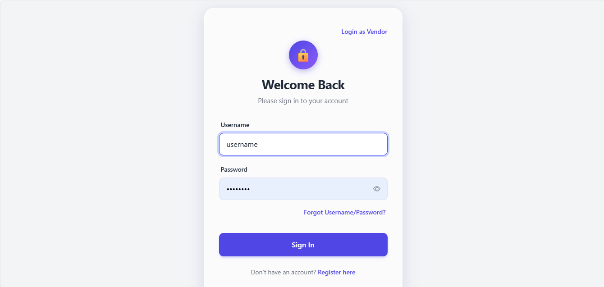
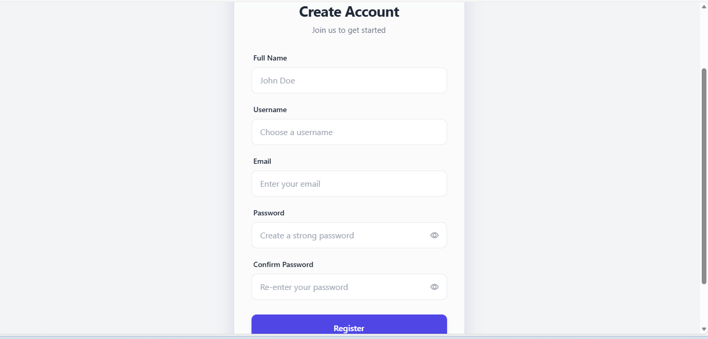
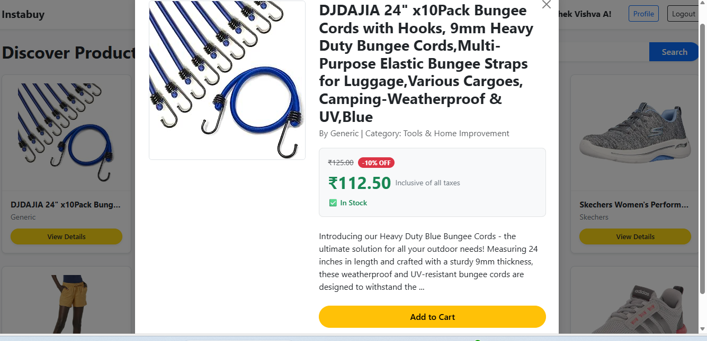
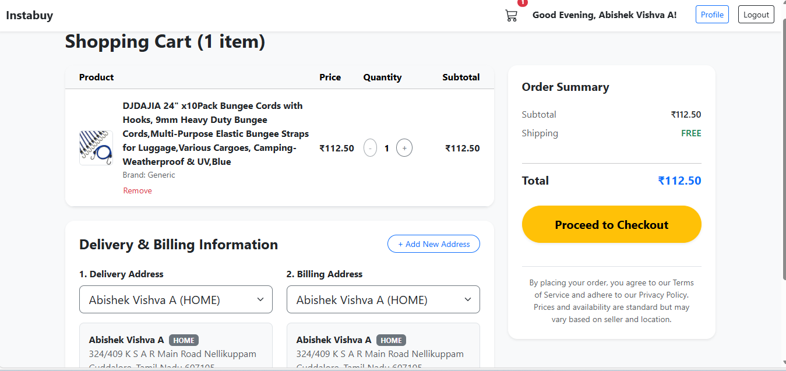
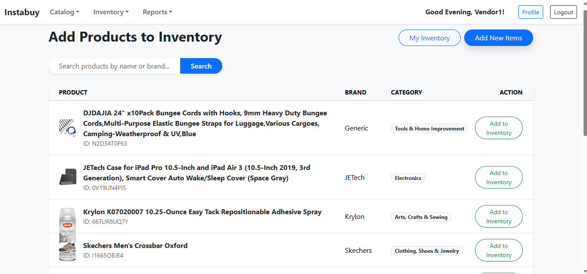
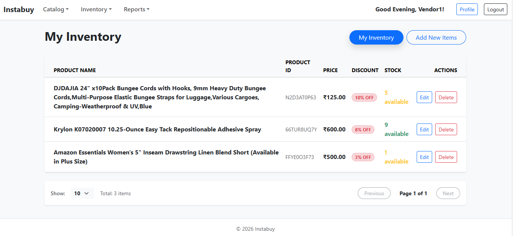
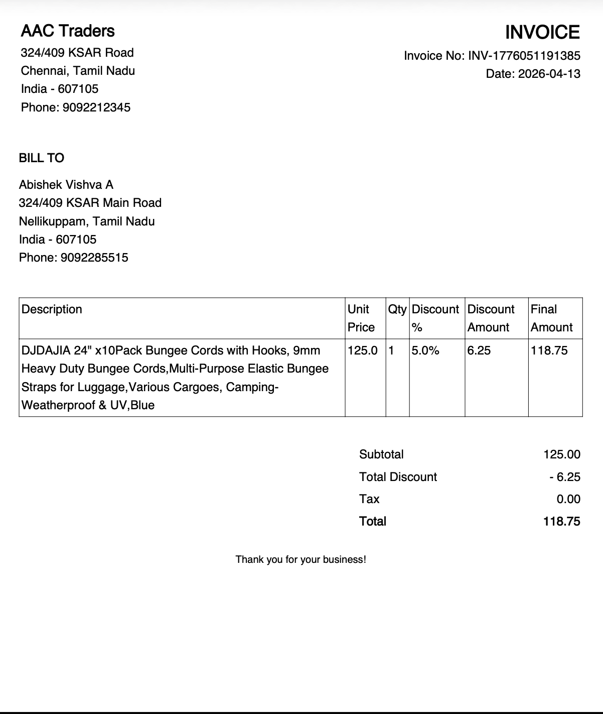

# InstaBuy 🛒

### Scalable Microservices-Based E-Commerce Platform

InstaBuy is a modern, full-stack E-Commerce platform designed using a **Microservices Architecture** to deliver high scalability, reliability, and seamless shopping experiences. The platform connects customers, vendors, inventory systems, and payment gateways through independently deployable services powered by Spring Boot and React.

Built to overcome the limitations of monolithic systems, InstaBuy ensures efficient order processing, secure payments, inventory consistency, and smooth performance even during high-traffic sales events.

---

# ✨ Project Highlights

✅ Microservices-Based Architecture /n
✅ Distributed Order Management System (OMS) \n
✅ REST API Communication Between Services
✅ JWT-Based Authentication & Authorization
✅ Inventory Validation & Stock Management
✅ Stripe & Multiple Payment Gateway Support
✅ Dockerized Deployment Support
✅ Service Discovery using Eureka
✅ API Gateway Routing
✅ Responsive React Frontend
✅ ACID-Compliant Transaction Management

---

# 📸 Application Screenshots

<table>
  <tr>
    <td align="center">
      <br/>
      <b>🔐 Login Page</b>
    </td>
    <td align="center">
      <br/>
      <b>📝 User Registration</b>
    </td>
    <td align="center">
      <br/>
      <b>📊 User Dashboard</b>
    </td>
  </tr>

  <tr>
    <td align="center">
      <br/>
      <b>🛍 Product Details</b>
    </td>
    <td align="center">
      <br/>
      <b>🛒 Shopping Cart</b>
    </td>
    <td align="center">
      <br/>
      <b>🏪 Vendor Catalog</b>
    </td>
  </tr>

  <tr>
    <td align="center">
      <br/>
      <b>📦 Vendor Products</b>
    </td>
    <td align="center">
      <br/>
      <b>📈 Vendor Dashboard</b>
    </td>
    <td align="center">
      <br/>
      <b>🧾 Invoice Generation</b>
    </td>
  </tr>
</table>

---

# 🚀 Features

## 👤 User Features

* User Registration & Secure Login
* JWT Authentication & Authorization
* Product Browsing & Search
* Add to Cart Functionality
* Order Placement & Tracking
* Invoice Generation
* Checkout & Payment Integration
* Order History Management

---

## 🏪 Vendor Features

* Vendor Registration & Authentication
* Product Upload & Management
* Inventory Monitoring
* Vendor Dashboard with Analytics
* Sales Insights & Reports
* Product Catalog Management

---

## 📦 Product & Inventory Features

* Product CRUD Operations
* Product Categorization & Filtering
* Inventory Availability Checks
* Real-Time Stock Updates
* Inventory Synchronization Across Services

---

## 💳 Payment Features

* Secure Payment Processing
* Stripe Payment Gateway Integration
* Payment Status Tracking
* Failed Transaction Handling
* Checkout Session Management

---

# 🏗 System Architecture

The platform follows a distributed **Microservices Architecture** where each service is independently deployable and scalable.

```text
                    +------------------+
                    |   React Frontend |
                    +--------+---------+
                             |
                             v
                  +--------------------+
                  |   API Gateway      |
                  | Spring Cloud GW    |
                  +---------+----------+
                            |
     ---------------------------------------------------
     |           |             |            |           |
     v           v             v            v           v

+-----------+ +-----------+ +-----------+ +-----------+ +-----------+
| User      | | Product   | | Inventory | | Order     | | Payment   |
| Service   | | Service   | | Service   | | Service   | | Service   |
+-----------+ +-----------+ +-----------+ +-----------+ +-----------+

                    |
                    v

             +-------------+
             | Eureka      |
             | Discovery   |
             | Server      |
             +-------------+
```

---

# ⚙️ Backend Microservices

## 🔹 API Gateway Service

Acts as the single entry point for all frontend requests and routes traffic to the appropriate microservices.

### Responsibilities

* Request Routing
* Load Balancing
* API Aggregation
* Security Filtering

---

## 🔹 Eureka Discovery Service

Implements Netflix Eureka for service registration and discovery.

### Responsibilities

* Dynamic Service Registration
* Service Discovery
* Fault Tolerance Support

---

## 🔹 User Service

Handles authentication and user management.

### Features

* JWT Authentication
* Role-Based Access Control
* User Profile Management

---

## 🔹 Product Service

Manages the complete product catalog lifecycle.

### Features

* Product CRUD
* Product Search
* Category Management
* Product Filtering

---

## 🔹 Inventory Service

Responsible for stock management and validation.

### Features

* Inventory Updates
* Stock Validation
* Real-Time Availability Tracking

---

## 🔹 Order Service

Handles all order-related workflows.

### Features

* Order Placement
* Order Status Tracking
* Order Cancellation
* Transaction Coordination

---

## 🔹 Payment Service

Processes secure online payments.

### Features

* Stripe Integration
* Payment Verification
* Webhook Handling
* Transaction Management

---

# 🔄 Transaction Management

The platform uses **Spring Transaction Management** to maintain:

* ACID Compliance
* Reliable Inventory Updates
* Consistent Payment Processing
* Rollback Mechanisms for Failures

This prevents:

* Duplicate Orders
* Inventory Mismatches
* Partial Payment Failures
* Inconsistent Order States

---

# 🛠 Tech Stack

## 🎨 Frontend

* React 19
* React Router DOM
* Bootstrap
* Axios
* Recharts

---

## ⚙️ Backend

* Java 17
* Spring Boot 3.5.x
* Spring Security
* Spring Cloud Gateway
* Netflix Eureka
* Maven
* Hibernate / JPA

---

## 🗄 Database

* MySQL

---

## ☁️ DevOps & Deployment

* Docker
* Docker Compose

---

## 💳 Third-Party Services

* Stripe Payment Gateway
* GreenMail (Email Testing)

---

# 📂 Project Structure

```bash
InstaBuy/
│
├── frontend/
│
├── backend/
│   ├── ApiGatewayService/
│   ├── EurekaService/
│   ├── UserService/
│   ├── ProductService/
│   ├── InventoryService/
│   ├── OrderService/
│   └── PaymentService/
│
├── docs/
│   └── images/
│
└── README.md
```

---

# 📦 Getting Started

# 🔧 Prerequisites

Make sure the following are installed:

* Node.js (v18+)
* Java 17
* Maven
* MySQL
* Docker Desktop
* Stripe Developer Account

---

# ▶️ Running Backend Services

Start services in the following order:

### 1️⃣ Start Eureka Service

```bash
cd backend/EurekaService
./mvnw spring-boot:run
```

---

### 2️⃣ Start API Gateway

```bash
cd backend/ApiGatewayService
./mvnw spring-boot:run
```

---

### 3️⃣ Start Remaining Microservices

```bash
cd backend/<ServiceName>
./mvnw spring-boot:run
```

Example:

```bash
cd backend/ProductService
./mvnw spring-boot:run
```

---

# ▶️ Running Frontend

### Navigate to Frontend

```bash
cd frontend
```

### Install Dependencies

```bash
npm install
```

### Start React App

```bash
npm start
```

Frontend runs on:

```text
http://localhost:3000
```

---

# 🐳 Docker Deployment

To run using Docker:

```bash
docker-compose up --build
```

---

# 🔐 Security

The application uses:

* JWT-Based Authentication
* Role-Based Authorization
* Protected API Routes
* Secure Payment Processing

---

# 📈 Future Enhancements

* Kubernetes Deployment
* Redis Caching
* RabbitMQ / Kafka Messaging
* AI-Based Product Recommendations
* Multi-Vendor Marketplace Expansion
* Elasticsearch Integration
* CI/CD Pipeline Automation

---

# 👨‍💻 Developed By

### InstaBuy Development Team

Designed and developed as a scalable enterprise-level E-Commerce Order Management System using modern Microservices Architecture principles.

---

# ⭐ Support

If you found this project useful:

⭐ Star the repository
🍴 Fork the project
🛠 Contribute to improvements

---

# 📄 License

This project is developed for educational and learning purposes.
